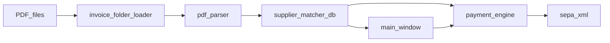

# PDF2SEPA — ontwikkelregels (hard rules)

Deze app verwerkt **financiële data**: PDF-facturen → interne factuurdicts → betalingsregels → **SEPA XML (pain.001.001.09)**. Fouten mogen **nooit** leiden tot een plausibel ogende maar **verkeerde betaling**.

Deze regels zijn **normatief**: bij twijfel tussen “ship snel” en “veilig falen” wint **veilig falen**.

---

## Golden Dataset Regression Safety (VERPLICHT)

Dit systeem gebruikt een golden dataset als absolute waarheid voor correcte business output per invoice.

Deze golden dataset wordt automatisch getest via:
tests/test_golden_dataset.py

### DOEL
Voorkomen dat bestaande correcte functionaliteit (parsing, matching, engine) onbedoeld wordt gebroken.

---

## VERPLICHTE WERKWIJZE BIJ ELKE CODEWIJZIGING

Na ELKE wijziging in de codebase (ongeacht scope: parser, engine, UI, matching, etc.) moet:

1. Altijd de volledige test suite worden gedraaid:

   python3 -m pytest

2. De uitkomst moet worden geanalyseerd:

### CASE 1 — Alle tests slagen
→ De wijziging is veilig  
→ Doorgaan toegestaan

### CASE 2 — Golden dataset test faalt (tests/test_golden_dataset.py)

Dit betekent:  
→ De business output is veranderd  
→ Dit is een REGRESSIE (tenzij expliciet anders bedoeld)

VERPLICHT:

- Analyseer exact welke velden verschillen:
  - amount
  - supplier_name
  - iban
  - customer_code
  - description
  - discount_percentage
  - invoice_date
  - payment_terms_days

- Leg kort uit:
  - wat er veranderd is
  - waarom dit gebeurt

- Daarna:

  OF:
  - draai de wijziging terug

  OF:
  - pas de implementatie aan zodat:
    - de nieuwe functionaliteit werkt
    - EN de bestaande golden dataset output identiek blijft

---

## BELANGRIJKE REGELS

- De golden dataset is de waarheid (ground truth)
- De golden dataset mag NIET aangepast worden zonder expliciete toestemming
- Geen silent regressies
- Geen “lijkt correct” aannames
- Geen wijzigingen die bestaande correcte output breken

---

## UITZONDERING

Alleen als expliciet wordt aangegeven:

"Dit is een bewuste wijziging van business logic"

→ Dan mag de golden dataset worden geüpdatet via:

python3 scripts/save_current_batch_as_golden.py

---

## SAMENVATTING

- Elke wijziging → pytest draaien
- Golden dataset faalt → fix of rollback
- Golden dataset blijft leidend

---

## 1. Bedragen: alleen `Decimal`, geen gokken

1. **Bron van waarheid voor geld** is `decimal.Decimal` met **exact twee decimalen** na afronding (bankiersafronding / `ROUND_HALF_UP`, consistent met [logic/payment_amounts.py](logic/payment_amounts.py)).

2. **`float` is verboden** voor bedragen die:
   - uit een factuur komen,
   - in betalingsdicts zitten die naar SEPA gaan,
   - of in sommen/kortingen/creditnota-logica gebruikt worden.  
   Uitzondering: **uitsluitend** voor niet-financiële UI-hulp (bijv. sorteerkeys), en dan nooit als bron voor XML.

3. **Nooit “best guess” bedrag accepteren** zonder expliciete, reproduceerbare regel:
   - Geen stille keuze tussen twee totaalregels zonder **confidence + blokkeerpad**.
   - Geen “binnen X cent” toleranties als **enige** criterium voor acceptatie van een bedrag; tolerantie mag alleen na **deterministische** normalisatie en **documentatie in tests**.

4. **Parser-output** moet bedragen als **string of Decimal** doorgeven, of een veld **`amount: None`** + **`amount_confidence`** / foutreden. Een parser die “iets” teruggeeft terwijl het PDF-bedrag niet hard te verifiëren is, **schendt** deze regels.

5. **`amount_to_decimal` mag nooit stil naar `0.00` voor ongeldige input** tenzij het contract van de functie expliciet “default zero” is **en** alle call sites aantonen dat `0` onmogelijk als echte betaling kan worden geëxporteerd. Voor SEPA-paden: **ongeldig bedrag = fout, geen export**.

6. **Afronding gebeurt op vaste momenten**: normaliseer naar 2 decimalen vóór sommatie waar de business dat voorschrijft; documenteer één keten (parser → engine → XML).

---

## 2. Parsing: generiek, niet per leverancier-PDF

1. **Verboden patroon**: `if supplier == "X" or "bedrijf Y" in text` in productiecode om één factuur te “fixen”. Zulke uitzonderingen horen in **testdata + regressietests**, niet in stille branches.

2. **Toegestaan**: nieuwe **generieke** heuristieken (labels, layout-patronen, EU-notaties) die voor **meerdere** facturen gelden, plus **minimaal één test** (unit of golden sample) die het gedrag vastlegt.

3. **Wijzigingen aan regex / label-prioriteit** in [parser/pdf_parser.py](parser/pdf_parser.py) vereisen:
   - welke **velden** geraakt worden (bedrag, datum, IBAN, …),
   - welk **risico** op false positives (verkeerd totaal, verkeerde datum),
   - en een **test** die faalt als de regressie terugkomt.

4. **Twee lagen tekst** (tekstlaag vs OCR): als OCR een veld vult dat de tekstlaag niet heeft, moet dat **zichtbaar** zijn in metadata (bijv. `iban_source`) of als review-flag — geen stille overschrijving zonder trace.

---

## 3. Data-integriteit: één waarheid, XML matcht de bedoeling

1. **SEPA XML** ([output/sepa_xml.py](output/sepa_xml.py)) moet kunnen worden afgeleid uit:
   - de **zelfde** `Decimal`-waarden als in de UI/engine,
   - met **dezelfde** grouping (batches per `execution_date`),
   - en `CtrlSum` / batch-`CtrlSum` = som van `InstdAmt` (modulo expliciet gedocumenteerde, geteste afrondingsregels).

2. **Geen deserialisatie-truc**: als betalingsdicts `float` bevatten, is dat een **technische schuld** richting XML — nieuwe code voegt **geen** extra float-stappen toe; refactors moeten richting **Decimal end-to-end** tot aan serialisatie.

3. **IBAN / BIC / debtorvelden**: ontbrekend of ongeldig ⇒ **geen** batch-export die die regel “wegmoffelt”. Valideren vóór schrijven van XML.

4. **Creditnota-koppeling** en saldo’s: elke wijziging in matchlogica moet **invarianten** beschrijven (bijv. “som credits ≤ factuurbedrag”) en tests hebben die bij schending falen.

---

## 4. Fail-fast: liever fout dan verkeerde betaling

1. **Fout zichtbaar maken**: `load_error`, `match_status`, `errors`-lijst van [logic/payment_engine.py](logic/payment_engine.py), UI-waarschuwingen — geen “lege string terug” waar een gebruiker denkt dat er geparset is.

2. **Verboden**: brede `except Exception: pass` of `return ""` / `return None` op paden waar **geld** of **export** afhangt, **tenzij** het resultaat expliciet als **niet-vertrouwd** wordt gemarkeerd en downstream **geblokkeerd** wordt.

3. **PDF-tekst**: het verschil tussen `extract_text_strict` en een wrapper die fouten slikt moet **helder** zijn: productiepaden die tot betaling leiden gebruiken **strict + expliciete foutstatus**, geen stille lege tekst.

4. **Debug logging** mag **nooit** de enige plek zijn waar een financiële afwijking zichtbaar is; geen hardcoded paden naar ontwikkelaarsmachines in productielogica.

---

## 5. Wijzigingsdiscipline

1. Elke PR/commit die gedrag raakt dat **bedragen**, **datums**, **IBAN**, **SEPA-export** of **matching** beïnvloedt, bevat:
   - **Wat** er verandert (1–3 zinnen),
   - **Waarom** (business/regel),
   - **Risico** (wat kan nu misgaan),
   - **Test** (bestaand uitgebreid of nieuw).

2. Geen merge van parserwijzigingen **zonder** minstens één **regressietest** op representatieve PDF-tekst of golden fixture.

3. Instellingen/data in [data/](data/) die export beïnvloeden: wijzigingen zijn **reviewbaar** (geen “even handmatig in productie JSON” zonder versie/trace).

---

## 6. Architectuur: altijd de pipeline

Denk in deze volgorde; wijzigingen **kleven** aan de stap waar de data ontstaat of gevalideerd wordt:

1. **Parser** levert **observaties** (waarden + confidence/bron), geen definitieve “business truth” zonder door de engine/settings te gaan.

2. **Engine** is de plek voor **consolidatie** (groepering per leverancier, credits, korting, termijnen) en **harde gates** (geen betaling zonder IBAN, negatief bedrag, etc.).

3. **UI** toont en bewerkt; het **normaliseert** niet op manieren die de engine/XML omzeilen. Export leest dezelfde canonieke velden als de engine.

4. **Geen losse patches** die alleen de UI fixen terwijl de engine hetzelfde foute dict zou accepteren — fix **contract + validatie** op de juiste laag.

---

## 7. Checklist vóór merge (financiële wijziging)

- Geen nieuwe `float`-financiële paden.
- Geen stille default-bedragen op exportpad.
- Fouten worden **geclassificeerd** (bucket/reden), niet weggegeten.
- Tests of fixtures bijgewerkt.
- Beschrijving in commit/PR volgens sectie 5.

---

*Laatste herziening: door team / Cursor-basisregels — bij conflict met product owner: expliciet besluit vastleggen.*
